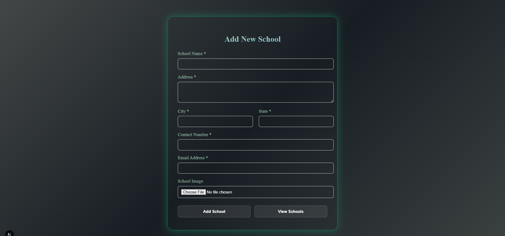

# School Management System

A web application for managing school information built with Next.js and MySQL.

## Features

- ✅ Add new schools with validation
- ✅ View all schools in a grid layout
- ✅ Form validation using react-hook-form
- ✅ Responsive design for mobile and desktop
- ✅ Image upload functionality
- ✅ MySQL database integration

## Tech Stack

- **Frontend**: Next.js, React, react-hook-form
- **Backend**: Next.js API Routes
- **Database**: MySQL
- **Styling**: CSS-in-JS

## Installation

1. Clone the repository:
```bash
git clone https://github.com/shabbir916/School-management-system
cd school-project
```

2. Install dependencies:
```bash
npm install
```

3. Set up MySQL database:
```sql
CREATE DATABASE school_db;
USE school_db;

CREATE TABLE schools (
    id INT AUTO_INCREMENT PRIMARY KEY,
    name TEXT NOT NULL,
    address TEXT NOT NULL,
    city TEXT NOT NULL,
    state TEXT NOT NULL,
    contact VARCHAR(20) NOT NULL,
    image TEXT,
    email_id TEXT NOT NULL
);
```

4. Configure environment variables:
Create a `.env.local` file in the root directory:
```
DB_HOST=localhost
DB_USER=your_username
DB_PASSWORD=your_password
DB_NAME=school_db
```

5. Run the development server:
```bash
npm run dev
```

6. Open [http://localhost:3000](http://localhost:3000)

## Pages

- `/` - Home page with navigation
- `/addSchool` - Form to add new schools
- `/showSchools` - Display all schools in grid view

## API Endpoints

- `POST /api/schools` - Add a new school
- `GET /api/schools` - Fetch all schools

## Form Validation

The add school form includes validation for:
- Required fields
- Email format validation
- Phone number format (10 digits)
- Image file size (max 5MB)
- Image file type validation

## Responsive Design

The application is fully responsive and works on:
- Desktop computers
- Tablets
- Mobile phones

## Deployment

The application can be deployed on:
- Vercel
- Netlify
- Any Node.js hosting platform

For production deployment, ensure you have:
1. A hosted MySQL database (e.g., PlanetScale, Railway)
2. Environment variables configured in your hosting platform
3. Proper error handling and security measures

### Contributing

Pull requests are welcome. For major changes, please open an issue first to discuss what you’d like to change.

## License

This project is licensed under the MIT License.

## Author

Shabbir Sadriwala

## Screenshots

1) ### Home Page:


2) ### Add School Page:


3) ### Show Schools Page:
